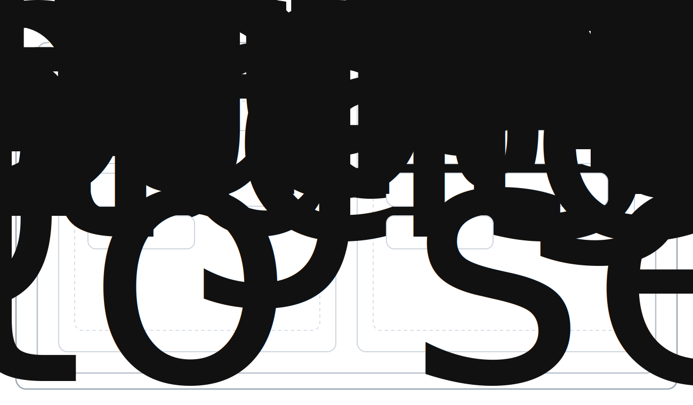

# Stack Architecture

Stack is delivered as a Kubernetes operator plus a set of curated operators that your clusters rarely ship out of the box.

## Operators, CRDs, and escape hatches

**Operator**: a controller that watches resources and keeps them in the desired state.  
**CRD**: a CustomResourceDefinition that adds new Kubernetes resource types.

Stack is just:

- A CRD (`StackApp`)
- An operator that reconciles it into Postgres, auth, REST, realtime, storage, and ingress services

Why this is good:

- **Declarative**: one manifest describes your app and its platform services.
- **Repeatable**: the same CRD works from dev to prod.
- **Composable**: add your own services alongside Stack.

Escape hatch:

- It is all Kubernetes, so you can inspect or edit resources with `kubectl` anytime.

Links:

- [Kubernetes Operators](https://kubernetes.io/docs/concepts/extend-kubernetes/operator/)
- [CustomResourceDefinition](https://kubernetes.io/docs/tasks/extend-kubernetes/custom-resources/custom-resource-definitions/)

## Stack is BaaS + deployment

Stack combines backend-as-a-service and deployment into one Kubernetes-native workflow. You can run it on a single VM or a full cluster, and the operator will provision the database, auth, storage, REST, and realtime services for each app namespace.

## Multiple Applications

Running multiple applications on one cluster keeps each app isolated with its own namespace, secrets, and database while sharing the same platform services. That means you can deploy, scale, and upgrade apps independently without cross-talk, and keep staging/production setups consistent across teams.

