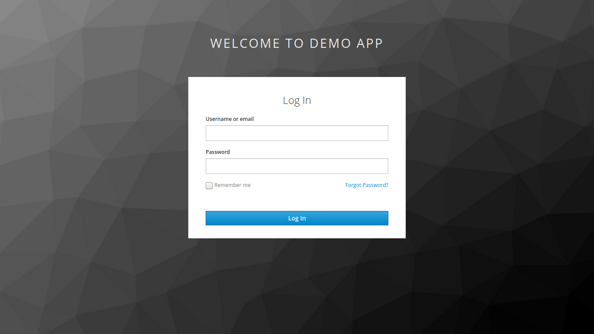

# Authentication

Stack supports two authentication capabilities:
- **OIDC gateway** via Keycloak + OAuth2 Proxy (protects your app behind `/oidc`).
- **Supabase Auth (GoTrue)** served at `/auth` when enabled.

When you run `stack init`, the CLI installs everything required to run a shared Keycloak control plane inside your cluster.


## Enabling OIDC (Keycloak + OAuth2 Proxy)

```yaml
spec:
  components:
    ingress:
      port: 30010
    db: 
    rest: {}
    oidc:
      # Required by keycloak for OIDC. OIDC requires a stable redirect URL.
      hostname-url: http://localhost:30013
      # Make keycloak admin accessible via /oidc/admin
      expose_admin: true
```

When you enable `oidc` in your Stack yaml all traffic to your app will be intercepted and a login/registration page will be shown.



## How Stack uses Keycloak

- Each `StackApp` with `spec.components.oidc.hostname-url` defined triggers the Stack controller to ensure a Keycloak realm and OAuth2 Proxy configuration exist.
- The CLI creates an initial admin secret named `keycloak-initial-admin` in the Keycloak namespace. `stack status --manifest …` reads this secret so you can log in instantly.
- OAuth2 Proxy is configured to trust Keycloak and inject the right upstream headers toward your app.

## What gets installed

1. **CustomResourceDefinitions** – `keycloaks.k8s.keycloak.org` and `keycloakrealmimports.k8s.keycloak.org` enable the operator to watch realms and servers.
2. **Keycloak Operator** – A deployment that reconciles `Keycloak` and `KeycloakRealmImport` resources.
3. **Dedicated namespace** – Stack creates (or reuses) the `keycloak` namespace so the identity stack stays isolated.
4. **Backing database** – The Keycloak operator provisions a CloudNativePG cluster for Keycloak itself; Stack wires credentials automatically.

## Verifying the installation

```bash
kubectl get pods -n keycloak
kubectl get keycloaks.k8s.keycloak.org -n keycloak
kubectl get secret keycloak-initial-admin -n keycloak -o yaml
```

If you ever need to reinstall Keycloak components (for example after manually deleting the namespace), re-run `stack init`. The CLI reapplies the CRDs, operator deployment, and database manifests idempotently.

## Enabling Supabase Auth (GoTrue)

```yaml
spec:
  components:
    auth:
      api_external_url: http://localhost:30010/auth
      gotrue_site_url: http://localhost:30010/auth
```

When `components.auth` is present, Stack deploys GoTrue and routes `/auth` through nginx. It also wires JWT and database credentials automatically.
