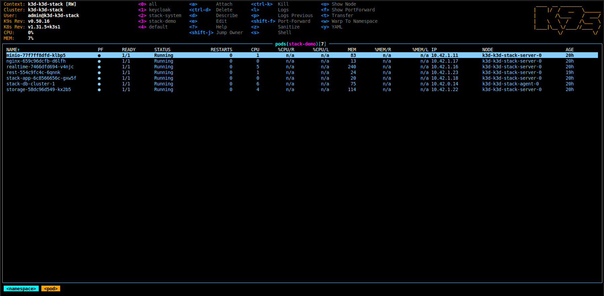

# Stack: Kubernetes + BaaS

Stack is a Kubernetes-first backend platform. It gives you three big wins from day one:

- **One manifest, full backend**: define your app and the backend services you need in a single `StackApp`.
- **Dev equals prod**: the same CRDs and operator workflow run everywhere Kubernetes runs.
- **No glue work**: Stack creates secrets and wires services automatically.

Looking for a deeper dive? Read the [Stack architecture guide](./architecture/) to see how the operator, CRDs, and supporting services interact.

## Other platforms

Other services that solve adjacent parts of the problem:

- [Supabase](https://supabase.com/)
- [Canine](https://docs.canine.sh/)
- [Disco](https://disco.cloud/)
- [Uncloud](https://uncloud.run/)
- [Kamal](https://kamal-deploy.org/)
- [Dokploy](https://dokploy.com/)
