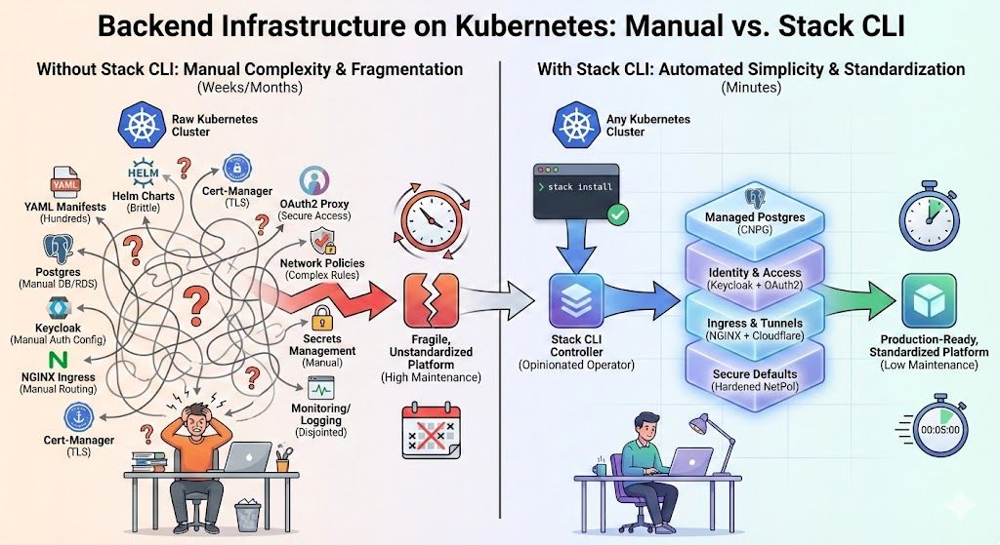

# Stack: Kubernetes + BaaS

Stack is a Kubernetes-first backend platform. It gives you three big wins from day one:

- **One manifest, full backend**: define your app and the backend services you need in a single `StackApp`.
- **Dev equals prod**: the same CRDs and operator workflow run everywhere Kubernetes runs.
- **No glue work**: Stack creates secrets and wires services automatically.

Looking for a deeper dive? Read the [Stack architecture guide](./architecture/) to see how the operator, CRDs, and supporting services interact.

## How Stack compares to related tools

Other platforms and services that solve adjacent parts of the problem.

| Tool                               | Primary focus                             | Backend services (DB, auth, APIs) | Deployment model         | Uses Kubernetes |
| ---------------------------------- | ----------------------------------------- | --------------------------------- | ------------------------ | --------------- |
| **Stack**                          | Full application stack (backend + deploy) | Yes                               | Declarative config (CRD) | Yes             |
| [Supabase](https://supabase.com/)  | Backend as a service                      | Yes                               | Managed service or DIY   | Optional        |
| [Canine](https://docs.canine.sh/)  | PaaS-style app hosting                    | No                                | Git-based deploys        | Yes             |
| [Disco](https://disco.cloud/)      | PaaS-style app hosting                    | No                                | Git push deploys         | No              |
| [Uncloud](https://uncloud.run/)    | Container deployment                      | No                                | Docker Compose           | No              |
| [Kamal](https://kamal-deploy.org/) | Application deployment                    | No                                | SSH-based                | No              |
| [Dokploy](https://dokploy.com/)    | App deployment & hosting                  | No                                | Docker / Docker Compose  | No              |
| [Nuvix](https://www.nuvix.in/)    | App deployment & hosting                  | Yes                                | Docker / Docker Compose  | No              |
