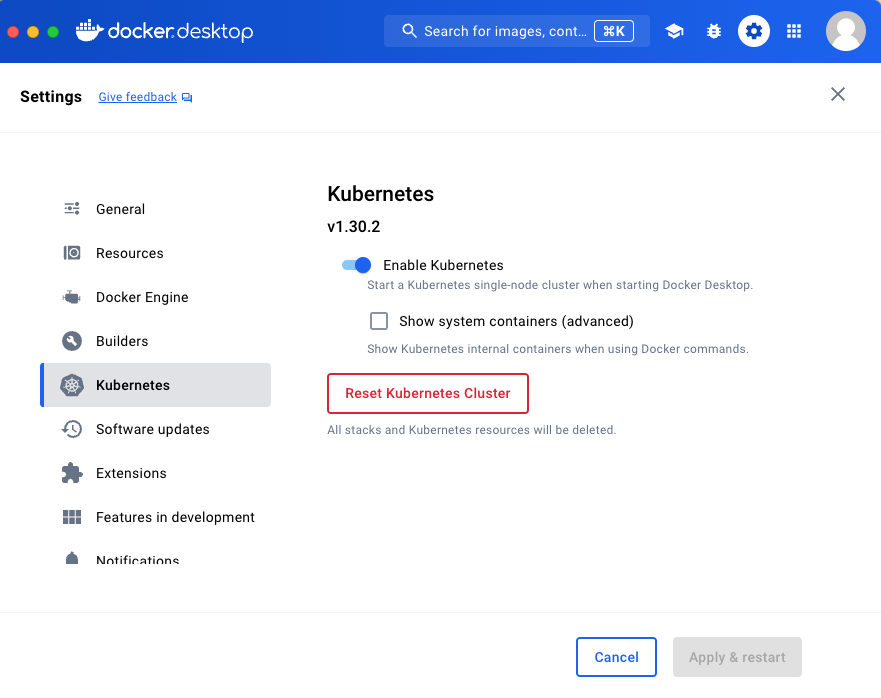

# Kubernetes Already?

You probably already have Kubernetes installed without realising it. Most Docker Desktop setups include a built-in single-node cluster, and k3s is a fast option if you want something closer to how you will run Stack in production.

## Option A — Docker Desktop



Docker Desktop with Kubernetes enabled is the easiest option for macOS, Windows, and most Linux desktops.

Steps:

1. Install Docker Desktop for your operating system.
2. Open Docker Desktop settings.
3. Enable Kubernetes.
4. Wait until Docker Desktop reports that Kubernetes is running.
5. Verify your setup:
   ```bash
   kubectl get nodes
   ```

Docker Desktop installs and configures `kubectl` automatically.

## Option B — k3s

[k3s](https://k3s.io/) is a lightweight Kubernetes distribution and closer to how you would run a single-node cluster in production.

Steps:

```bash
curl -sfL https://get.k3s.io | sh -
export KUBECONFIG=/etc/rancher/k3s/k3s.yaml
kubectl get nodes
```
