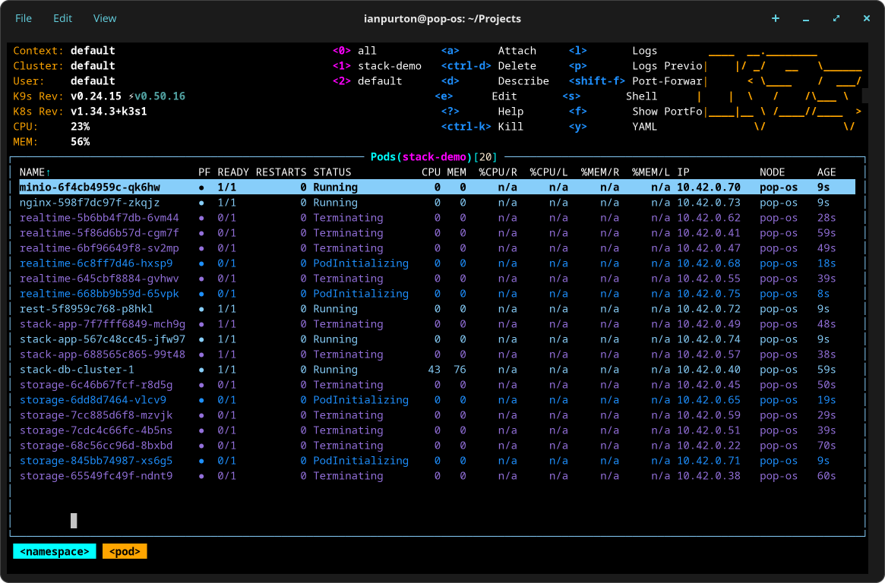

# Stack Init

Before you begin, set up a local Kubernetes cluster. See the [Kubernetes Already?](../local-kubernetes/) guide for Docker Desktop and k3s options.

## Install Stack

1. **Grab the CLI.**

   ```bash
   curl -fsSL https://stack-cli.com/install.sh | bash
   ```

2. **Bootstrap the platform operators into your cluster.**

   ```bash
   stack init
   ```

   This command installs CloudNativePG, Keycloak, ingress, the Stack controller, and custom resource definitions that describe your applications.

   ```bash
   🔌 Connecting to the cluster...
   ✅ Connected
   🐘 Installing Cloud Native Postgres Operator (CNPG)
   ⏳ Waiting for Cloud Native Postgres Controller Manager
   🛡️ Installing Keycloak Operator
   📦 Creating namespace keycloak
   ⏳ Waiting for Keycloak Operator to be Available
   🌐 Installing Nginx Ingress Operator
   ⏳ Waiting for Nginx Operator to be Available
   📦 Creating namespace stack-system
   📜 Installing StackApp CRD
   ⏳ Waiting for StackApp CRD
   🔐 Setting up roles
   🤖 Installing the operator into stack-system
   🗄️ Ensuring Keycloak database in namespace keycloak
   ✅ Keycloak database created.
   🛡️ Ensuring Keycloak instance in namespace keycloak
   ```

3. **Apply the demo StackApp manifest.**

   ```bash
   curl -fsSL https://raw.githubusercontent.com/stack-cli/stack-cli/main/demo-apps/demo.stack.yaml \
     -o demo.stack.yaml
   stack install --manifest demo.stack.yaml
   ```

   You should see

   ```bash
   🔌 Connecting to the cluster...
   ✅ Connected
   📜 Installing StackApp CRD
   ⏳ Waiting for StackApp CRD
   📦 Creating namespace stack-demo
   🚀 Applied StackApp `stack-app` in namespace `stack-demo`
   ```

## What just happened?

You now have a Kubernetes namespace with a full backend stack wired together:

- A Postgres cluster created for your app.
- Auth, REST, Realtime, and Storage services ready to use.
- Secrets created for database URLs and JWTs.
- An nginx gateway that exposes `/auth`, `/rest`, `/realtime`, and `/storage`.

If you come from a Next.js background, think of this as a production-ready backend running beside your app, but declared with a single manifest instead of a pile of services.

## Optional: install k9s

[k9s](https://k9scli.io/) is a terminal UI for Kubernetes. It makes it easy to browse pods, logs, and services while you are learning the platform.

```bash
brew install k9s
```

On Linux, follow the install guide in the k9s docs.

## Watching Startup

With `k9s` you can see the demo applications pods downlaoding and starting


